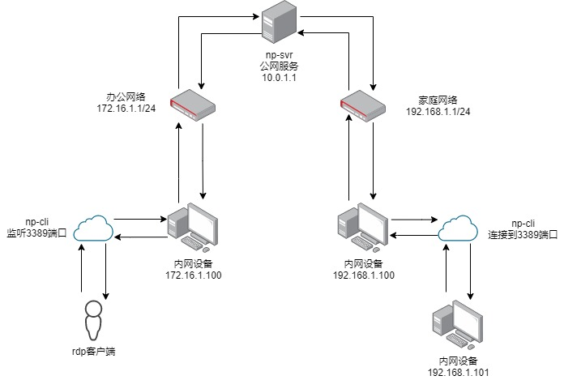

# natpass

内网穿透工具

## 实现原理

基于tls链接，protobuf进行数据传输，下面举例在办公网络穿透到家庭网络，
并通过rdp进行连接家庭网络下的某台windows设备

server端配置(10.0.1.1)：

    listen: 6154       # 监听端口号
    secret: 0123456789 # 预共享密钥
    log:
      dir: /opt/natpass/logs # 路径
      size: 50M   # 单个文件大小
      rotate: 7   # 保留数量
    tls:
      key: /dir/to/tls/key/file # tls密钥
      crt: /dir/to/tls/crt/file # tls证书

家庭网络client配置(192.168.1.100)：

    id: home              # 客户端ID
    server: 10.0.1.1:6154 # 服务器地址
    secret: 0123456789    # 预共享密钥，必须与server端相同，否则握手失败
    log:
      dir: ./logs # 路径
      size: 50M   # 单个文件大小
      rotate: 7   # 保留数量

办公网络client配置(172.16.1.100)：

    id: work               # 客户端ID
    server: 10.0.1.1:6154 # 服务器地址
    secret: 0123456789     # 预共享密钥，必须与server端相同，否则握手失败
    log:
      dir: ./logs # 路径
      size: 50M   # 单个文件大小
      rotate: 7   # 保留数量
    tunnel:                         # 远端tunnel列表可为空
      - name: rdp                   # 链路名称
        target: home                # 目标客户端ID
        type: tcp                   # 连接类型tcp或udp
        local_addr: 0.0.0.0         # 本地监听地址
        local_port: 3389            # 本地监听端口号
        remote_addr: 192.168.1.101  # 目标客户端连接地址
        remote_port: 3389           # 目标客户端连接端口号

工作流程如下：

1. 办公网络与家庭网络中的np-cli创建tls连接到np-svr
2. np-cli服务发送握手包，并将配置文件中的secret字段进行md5哈希
3. np-svr等待握手报文，若等待超时则为非法链接，直接断开
4. 办公网络客户机创建新连接到172.16.1.100的3389端口
5. 172.16.1.100上的np-cli接收到新请求后创建新的link并生成链接id
6. 172.16.1.100上的np-cli发送connect_request消息，告知连接类型和链接目标地址和端口
7. np-svr转发connect_request消息至192.168.1.100上的np-cli
8. 192.168.1.100上的np-cli接收到connect_request消息，根据请求信息创建链接到目标地址和端口
9. 192.168.1.100上的np-cli根据链接创建结果返回connect_response消息
10. np-svr转发connect_response消息至172.16.1.100上的np-cli
11. 172.168.1.100上的np-cli接收到connect_response消息后根据是否成功来决定是否需要断开rdp客户端链接
12. 链路打通，两端各自发送data消息到对应链路

## 编译

    ./build

## linux部署

1. 将init.d/np-cli和init.d/np-svr拷贝至/etc/init.d目录
2. 创建/opt/natpass和对应目录

        sudo mkdir -p /opt/natpass/bin /opt/natpass/conf
3. 将编译出的二进制文件拷贝至/opt/natpass/bin目录
4. 将配置文件拷贝至/opt/natpass/conf目录，并修改对应参数
5. 设置开机启动项

        sudo systemctl enable np-svr
        或
        sudo systemctl enable np-cli
6. 启动对应服务

        sudo /etc/init.d/np-svr start
        或
        sudo /etc/init.d/np-cli start